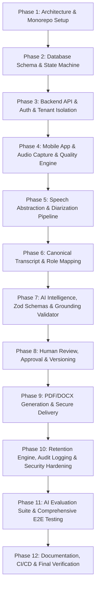

# Vabatim Architecture Audit & Implementation Plan

**Date**: August 20, 2026  
**Status**: Initial Baseline Audit  
**Location**: `c:/Users/Administrator/CrossDevice/Pixel 8 Pro/ai summary`

---

## 1. Executive Summary & Audit Findings

### 1.1 Repository State
- **Discovered Files**: None (Empty Workspace Repository).
- **Existing Framework**: None.
- **Existing Backend / Frontend**: None.
- **Existing Database / Migrations**: None.
- **Technical Debt**: Clean slate; architecture to be designed and implemented ground-up to exact specifications.

### 1.2 Identified Architectural Mandates
Vabatim is an **AI-powered accessibility documentation assistant** specifically engineered for UK wheelchair/seating and mobility therapists and clinicians.

Key Requirements:
1. **Strict Safety & Non-Invention Policy**:
   - LLMs must **never** determine speaker identity or perform speaker diarization.
   - LLMs must **never** infer unstated diagnoses, clinical findings, actions, or recommendations.
   - Missing fields must strictly return `"Not stated"`.
   - All extracted claims must be deterministically grounded with source segment IDs, timestamps, and exact text evidence.
2. **UK Regulatory & Clinical Context**:
   - Designed in compliance with UK GDPR, Data Protection Act 2018, ICO guidance, and NHS governance principles.
   - Any legal statements/features flagged as `REQUIRES ORGANISATIONAL / LEGAL / DPO REVIEW`.
3. **Canonical Pipeline Architecture**:
   - Audio Capture -> Speech Recognition & Diarization -> Canonical Transcript -> Speaker Role Mapping -> LLM Structured Extraction (Zod) -> Deterministic Grounding Validator -> Clinician Review -> Clinician Approval -> PDF/DOCX Generation -> Secure Link Delivery -> Retention & Audit Log.

---

## 2. Target Technology Stack & Component Design

| Subsystem | Technology Choice | Rationale / Capability |
| :--- | :--- | :--- |
| **Backend API** | Node.js / TypeScript (Strict), Express | Clean REST architecture, strong Zod integration, high performance |
| **Database & ORM** | PostgreSQL, Prisma ORM | Relational integrity, strict typing, migration support, enum state machine |
| **Queue & Async Workers** | Redis, BullMQ | Reliable job processing, retries, exponential backoff, dead-letter queues |
| **Mobile App Framework** | React Native / Expo (TypeScript) | Cross-platform, audio recording, role mapping, consent UI, offline resilience |
| **Speech Recognition & Diarization** | Abstracted `SpeechProvider` | Supports Google Cloud Speech, Azure Speech, & `MockSpeechProvider` for local dev |
| **LLM & Extraction Engine** | Abstracted `LLMProvider` + Zod Schema | Structured JSON extraction with strict evidence linking and fallback "Not stated" |
| **Grounding Validator** | Custom Deterministic Engine | Validates segment IDs, timestamp boundaries, and source text alignment prior to review |
| **Document Generation** | `pdfkit` (PDF), `docx` (Word) | Clean server-side document rendering without external binary dependencies |
| **Storage & Delivery** | Encrypted S3 / Local Storage Adapter + `EmailProvider` | Signed short-lived URLs, no raw attachments |
| **AI Evaluation Harness** | Custom Benchmark Suite (`evaluation/`) | Measures WER, DER, evidence grounding precision, and unsupported claim rates |

---

## 3. Core Database Schema & State Machine Strategy

### 3.1 Meeting State Machine
The database enforces explicit lifecycle transitions:
`CREATED` → `CONSENT_PENDING` → `READY` → `RECORDING` → `UPLOADING` → `UPLOADED` → `TRANSCRIBING` → `DIARIZATION_COMPLETE` → `TRANSCRIPT_READY` → `EXTRACTION_RUNNING` → `EXTRACTION_COMPLETE` → `VALIDATION_FAILED` (if ungrounded) → `PENDING_REVIEW` → `UNDER_REVIEW` → `APPROVED` → `DOCUMENT_GENERATING` → `DOCUMENT_READY` → `DELIVERY_PENDING` → `DELIVERED` → `FAILED` / `DELETED`.

### 3.2 Key Models (Prisma)
- **User & Organisation**: RBAC (`CLINICIAN`, `ADMIN`), multi-tenant isolation by `organisationId`.
- **Meeting & Participant**: Pseudonymous client references, clinician ID, retention policy, consent status, participant roles (`THERAPIST`, `CLIENT`, `CARER`, `INTERPRETER`).
- **ConsentRecord**: Configurable policy text version, timestamp, actor metadata, signed record.
- **Recording**: File format, sample rate (16kHz PCM target), bitrate, channels, storage reference, status.
- **TranscriptSegment**: Canonical representation containing `startTimeMs`, `endTimeMs`, `speakerId`, `role`, `text`, `confidence`, `overlapStatus` (`CLEAR`, `SUSPECTED`, `UNKNOWN`), `sourceProvider`.
- **ClinicalNote & Evidence**: Structured JSON containing evidence-linked claims for client concerns, environmental accessibility barriers, seating/wheelchair concerns, MAT assessment metrics, and explicit actions.
- **AuditLog**: Tamper-evident event log for auth, consent, audio access, transcript access, note edits, approvals, document downloads, and automated deletions.

---

## 4. Implementation Strategy & Execution Phases

1. **Monorepo & Environment Setup**: Root TypeScript config, Express server scaffold, React Native/Expo app scaffold.
2. **Database Engine**: Prisma schema definition, migration generation, seed data, state machine validator.
3. **Core Services**: Speech provider abstraction (`GoogleSpeechProvider`, `AzureSpeechProvider`, `MockSpeechProvider`), Email abstraction (`Resend`/`SMTP`/`MockEmailProvider`), Object Storage abstraction (`S3`/`LocalStorageProvider`).
4. **AI & Validation Engine**: Structured prompt builder, Zod schema validation, deterministic evidence validator.
5. **Document & Delivery Engine**: PDF/DOCX compiler, short-lived signed URL manager, notification dispatcher.
6. **Mobile Interface**: Complete workflow screens (Auth, Consent, Audio Capture, Quality Check, Role Mapping, Note Review & Approval, Document Download).
7. **Evaluation & Verification**: Evaluation harness runner, full Jest unit/integration test suite, security authorization tests.

---

## 5. Governance & Compliance Disclaimer Notice

> [!IMPORTANT]
> **REQUIRES ORGANISATIONAL / LEGAL / DPO REVIEW**  
> Technical controls implemented in Vabatim (such as encryption at rest/transit, audit logging, short-lived URLs, and configurable retention) support UK GDPR compliance. However, software implementation alone does not constitute legal certification, NHS approval, MHRA clearance, or clinical safety accreditation. The deploying organisation's Data Protection Officer (DPO) and Clinical Governance Lead must review and execute appropriate Data Protection Impact Assessments (DPIA) and Clinical Risk Management plans.
